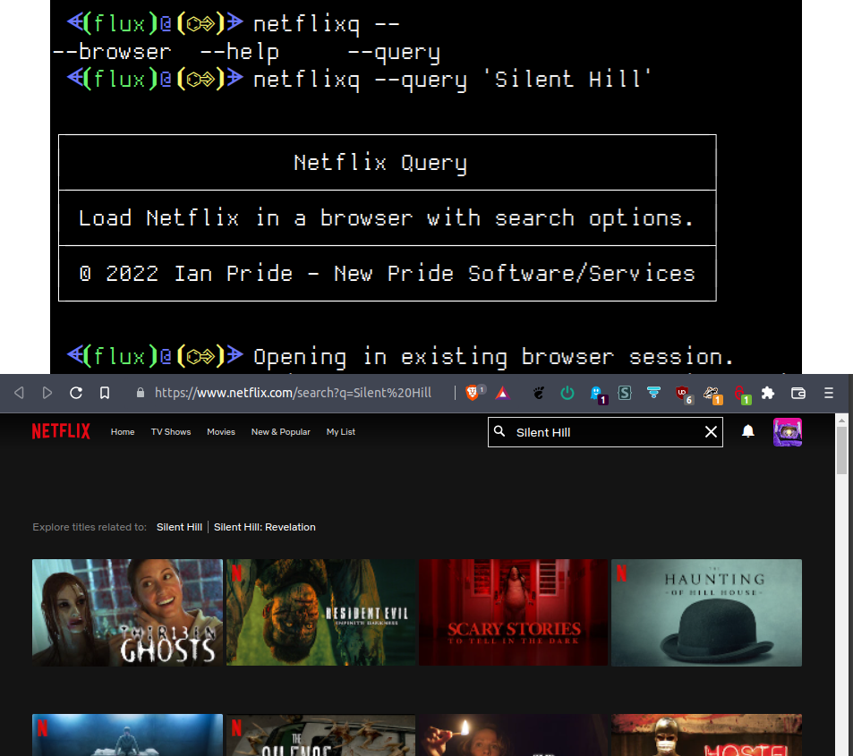
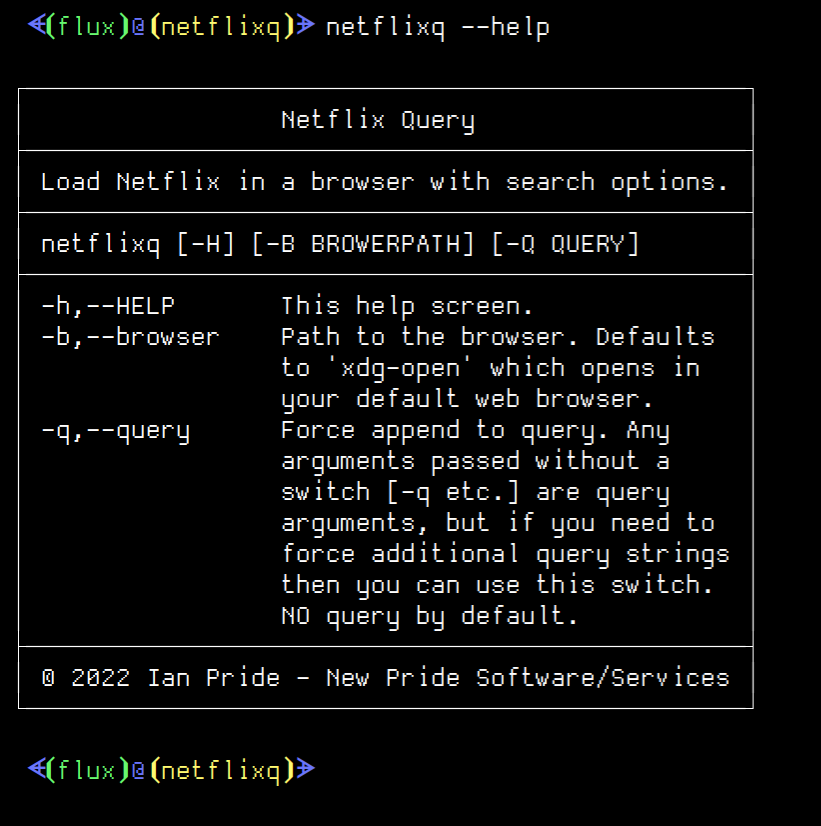

# Netflix Query

Load Netflix in a browser with search options&#46;

***DISCLAIMER***: <mark>&nbsp;&nbsp;&nbsp;***THIS IS STILL UNDER CONSCTRUCTION, COMING VERY SOON!***&nbsp;&nbsp;&nbsp;</mark>

- [Netflix Query](#netflix-query)
  - [About](#about)
    - [Description](#description)
    - [Motivation](#motivation)
    - [Where To Get](#where-to-get)
    - [Disclaimers and Warnings](#disclaimers-and-warnings)
      - [Not Working in Android at the Moment](#not-working-in-android-at-the-moment)
      - [Testing](#testing)
  - [Usage](#usage)
    - [Environment and Information](#environment-and-information)
    - [Examples](#examples)
  - [MD5 Information](#md5-information)
    - [Current Windows X86 MD5](#current-windows-x86-md5)
    - [Current Windows X64 MD5](#current-windows-x64-md5)
    - [Current Linux MD5](#current-linux-md5)
    - [Current Debian MD5](#current-debian-md5)
    - [Current MacOs MD5](#current-macos-md5)
    - [Current Android 32 Bit MD5](#current-android-32-bit-md5)
    - [Current Android 64 Bit MD5](#current-android-64-bit-md5)
  - [Media](#media)
    - [Logo](#logo)
    - [Help Screen](#help-screen)
    - [Demo Screen](#demo-screen)
  - [LICENSE](#license)

---

## About

All about this program and project&#46;

### Description

  
What is this&#63;

  

  This is a console tool for the <strong>Windows</strong>&#44; <strong>Linux</strong>&#44; <strong>MacOS</strong>&#44; and <strong>Android</strong> &#40;<i>Termux</i>&#41; command line environment help <strong>search for content</strong> or just <strong>open Netflix</strong> in the default browser or in one passed to the program via the <code>-b,--browser</code> switch&#46;
  

### Motivation

  
Why did I write this&#63;

  

    A replacement for a usual script I write in various languages in the various environments that heps me automate quick searching for stuff on <i>Netflix</i> when sitting with my laptop while watching stuff with my wife&#46; She&#x27;ll &#x28;or I&#x29; will want to know if <i>Netflix</i> has something and I'll sometimes use my script &#x28;or <i>Zenity</i> gui&#x29; and do a aquick search&#x46; I wrote this as a somewhat more &#x22;portable&#x22; to have a backend for doing these searches easier&#46;
  

### Where To Get

  
Download or build&#46;

  

  You can fork this repository and build yourself or you can download it at the current <a href="https://github.com/Lateralus138/netflixq/releases">Releases</a> page&#46;

  You can &#40;as with any of my projects&#41; fork and build this project yourself in keeping with the provided <a href="#LICENSE" >LICENSE</a> below.
  

### Disclaimers and Warnings

#### Not Working in Android at the Moment

Please see <a href="#testing">Testing</a> details expansion &#x28;&#x25B6;&#x29;&#46;

#### Testing

  
Testing

  

    This has been manually tested in Windows&#x2c; Linux&#x2c; and Android&#x2c; but not MacOs&#46; This is not currently working in Android&#x2c; but should by design&#46; I just haven&#x27;t had a chance to look at it yet and it&#x27;s not that big of a deal at the moment&#46; I do plan to get around to fixing it eventually&#46;
  

|Operating System|Tested?|Success?|
|---:|---:|---:|
|Windows|&#x2713;|&#x2713;|
|Linux|&#x2713;|&#x2713;|
|Android|&#x2713;|&#128473;|
|MacOs|&#128473;|&#128473;|

---

## Usage

Where and how to use this program&#46;

### Environment and Information

 

  
Where do I use this&#63;

  

  Like any cli tool &#40;or any executable for that matter&#41; this can be used in any available command line program&#47;emulator in <strong>Windows</strong> like <strong>CMD</strong> or <strong>PowerShell</strong>&#44; for example&#44; and should work in most available terminals&#46;
  
  This is a cross&#45;platform program and has been compiled for Windows&#44; Linux&#44; MacOS&#44; and Android &#40;Termux&#41;&#44; but the source is readily available and can be more than likely be built for most platforms&#46;

  The MacOs version has not been tested well &#40;only in a CI&#41; so if there any issues and you are in a direct MacOs environment and want to fork and work on the project yourself and or contribute to this project then you are free to do so as per the license provided&#46;

  Like any portable program in this can either be placed somewhere in your <code>%PATH%</code> and if not then when your run it you&#39;ll need to provide the direct path of the executable&#46;
  

  <h4>Example Given</h4>
  <pre>
    <code> > & &#39;C:\Users\&#60;USERNAME&#62;\Bin\netflixq.exe&#39; /&#63; </code>
  </pre>

### Examples

  
CMD/PowerShell Examples&#46;

  
Search for a movie&#46;

  

---

## MD5 Information

This information is generated in a *GitHub Action* immediately after the successful build of this project.

### Current Windows X86 MD5

### Current Windows X64 MD5

### Current Linux MD5

### Current Debian MD5

### Current MacOs MD5

### Current Android 32 Bit MD5

### Current Android 64 Bit MD5

---

## Media

### Logo

  
Logo, the icon for this program&#46; 

  

### Help Screen

  
Help, screenshot of the help screen&#46; 

  

### Demo Screen

  
Demonstration&#46; 

  

---

## [LICENSE](./LICENSE)

****

  
License Excerpt

   
  <blockquote>
  This program is free software&#58; you can redistribute it and&#47;or modify it under the terms of the GNU General Public License as published by the Free Software Foundation&#44; either version 3 of the License&#44; or &#40;at your option&#41; any later version&#46;
  </blockquote>
   
  <blockquote>
  This program is distributed in the hope that it will be useful&#44; but WITHOUT ANY WARRANTY&#59; without even the implied warranty of MERCHANTABILITY or FITNESS FOR A PARTICULAR PURPOSE&#46;  See the GNU General Public License for more details&#46;
  </blockquote>

